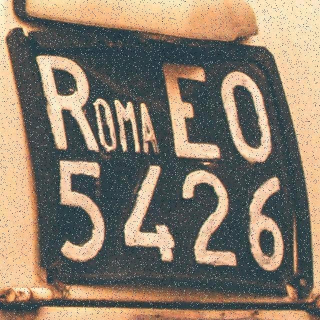
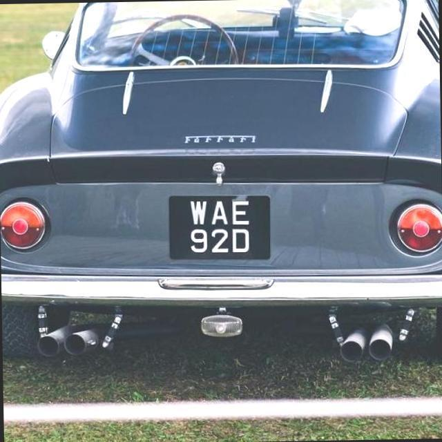
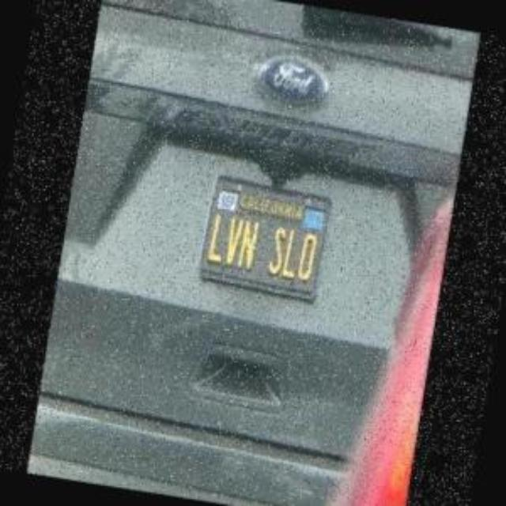
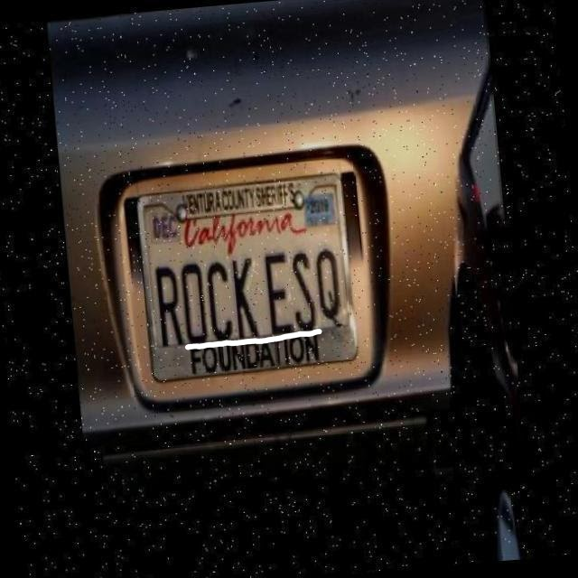
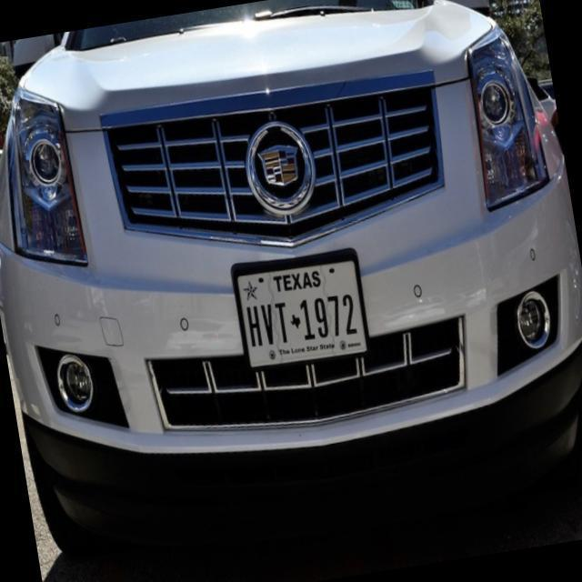
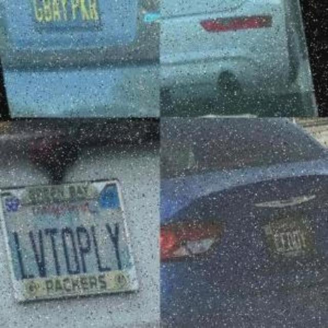
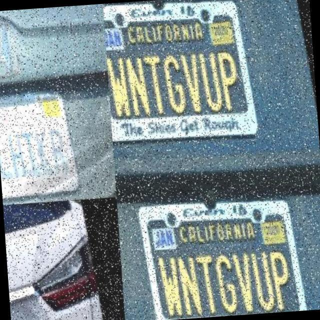
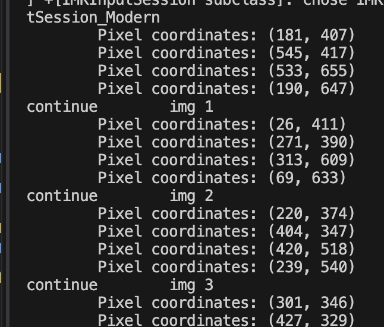

# License_Plate_Detection_Database

Author: Gian Fajardo

This is the [database](https://universe.roboflow.com/amykun-qoz6t/license-plate-recognition-8fvub) by Amykun from Roboflow that the machine learning subgroup (Bryan, Leo, and I) used for test characters. Keep in mind that this functioned as a license plate detection dataset. Because we needed characters flat against the screen, these characters had to be extracted manually using a procedure, which was assigned to Leo and I.

There were three broad categories of image for license plate detection purposes. We included and excluded plates and characters depending on the following three categories.

## International License Plate Images

There were the international-based license plates. These were excluded from the process entirely.

## US License Plate Images

There were license plates from California. There were others from other states. Because we just needed the dataset, these types of plate were processed, and some were discarded depending on if they were similar enough to the CA styling. Here are some examples:

## Multi-License Plate Images

Still, there were some test images like these. These were still included in the batch if they had a CA license plate within it. For example, there are these two images:

## The Process

Run `perspective_transform.py`. You will be instructed to find the four corners of the license plate in the image. Start with clicking on the matplotlib figure in the specified order:

1. the top-left corner, then
2. the top right corner, then
3. the bottom-right corner, and finally
4. the bottom-left corner.

You will receive feedback when the terminal gives the coordinates of the figure.

This realigns the plates and places the folder onto `<main_folder>/b_cropped_plates` folder.

---

Next, run `segmentation.py`. You will be given three windows, each of which will contain: the non-inverted image, the resulting images, and the character that the segmentation has given. You will be instructed to invert the image, leave as is, or skip the image. Type onto the terminal the choice you want.

Once the choice is picked, the resulting image is displayed. Make sure that the foreground is black and the background is white. if the first two options are picked, give the letter information onto the terminal. Once done, they should go to `<main_folder>/c_cropped_letters` folder.
